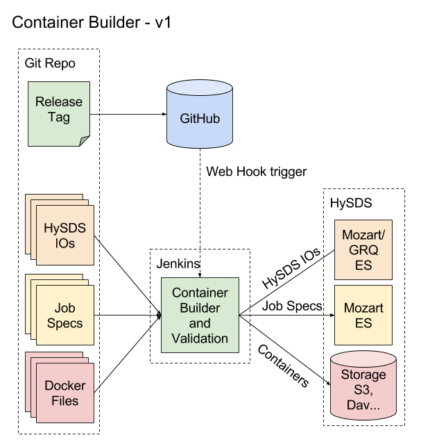

# Container Builder CI

This repository contains the custom scripts used to perform CI on docker containers containing PGE code needed to run within HySDS. These
scripts are run from within Jenkins and perform validation and execution of a docker build. The resultiing projects are archived within
HySDS and are exposed via REST interfaces and (if HySDS-IO is defined) within Tosca.

In order to properly run within this system, a job-spec file must be defined as well as a docker file. hysds-io spec files are optional.

## System Diagram and Flow



Container builder is tirggered when a matching check-in is pushed to GitHub and a (pre-configured) webhook calls back to Jenkins starting
the build.  The build comes in 2 parts, the mostly generic setup script, and the fully generic container-builder script. The setup script
is saved within Jenkins and handles checking out the repository and repositories it depends on. It then runs container-builder to validate
the IO and spec files, run the build and ingest the specs and containers into the HySDS system.

## HySDS-IO and Job Spec Files

These files are fully documented as part of the adapter Wiki pages: https://wiki.jpl.nasa.gov/display/hysds/Job+and+HySDS-IO+Specifications

## Basic Setup Script Example

These scripts can be automatically generated using the scripts in hysds_cluster_setup, however; provided here is an example setup script
annotated with comments to give the user a basic understanding.

The SKIP_PUBLISH flag enable the user to optionally skip the step where it saves out the built image to disk, gzips it, and publishes it. This could be used in cases where a Jenkins job can use this feature for Pull Requests to verify a successful build. If  its value is "noskip" then the image will be saved, otherwise the image will not be saved.

```
#!/bin/bash
#Pull the tag out from the provided GIT_BRANCH environment variable
TAG="${GIT_BRANCH##*/}"
#Get repo path by removing http://*/ and .git from GIT_URL
#repo path is used for automatic naming where suffixes are not supplied
REPO="${GIT_URL#*://*/}"
REPO="${REPO%.git}"
REPO="${REPO//\//_}"
#Configure where the storage for containers lives, allowing us to upload the container product
STORAGE="s3://s3-us-west-2.amazonaws.com/my-code-bucket/"
export GIT_OAUTH_TOKEN="<GIT OAUTH TOKEN>"
export MOZART_REST_URL="<MOZART_REST_URL>"
export GRQ_REST_URL="<GRQ_REST_URL>"
export CONTAINER_REGISTRY="localhost:5050"
export CONTAINER_REGISTRY_BUCKET="container-registry-bucket"
export SKIP_PUBLISH="noskip"
#Run the container-builder
if [ -z "$SKIP_PUBLISH" ]
then 
  export SKIP_PUBLISH="noskip";
fi
if [ ! -z "$CONTAINER_REGISTRY" -a ! -z "$CONTAINER_REGISTRY_BUCKET" ]
then
  ~/verdi/ops/verdi/ops/container-builder/build-container.bash \
  ${REPO} ${TAG} ${STORAGE} ${MOZART_REST_URL} ${GRQ_REST_URL} ${SKIP_PUBLISH} ${CONTAINER_REGISTRY} --build-arg GIT_OAUTH_TOKEN=${GIT_OAUTH_TOKEN} --build-arg BRANCH=${TAG}
else
  ~/verdi/ops/verdi/ops/container-builder/build-container.bash \
  ${REPO} ${TAG} ${STORAGE} ${MOZART_REST_URL} ${GRQ_REST_URL} ${SKIP_PUBLISH} "" --build-arg GIT_OAUTH_TOKEN=${GIT_OAUTH_TOKEN} --build-arg BRANCH=${TAG}
fi

```

## Extra features

Containers, job-specs, and hysds-io files are automatically named. If a file exists with a "suffix" .<name> that name is used instead of
the default.

Job-specs and HySDS-IOs should come in pairs (or single job-specs only). They will grab the defaul container docker file unless a dockerfile
with the same prefix exists.
